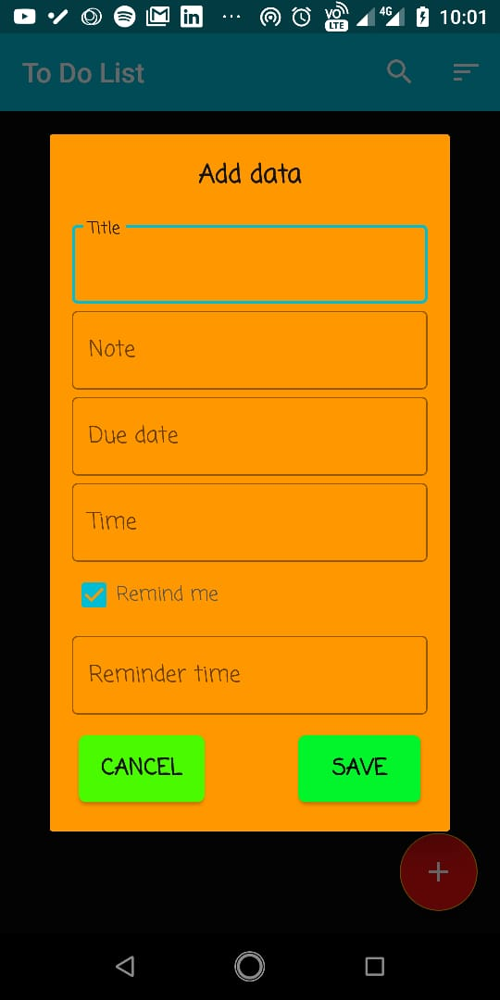
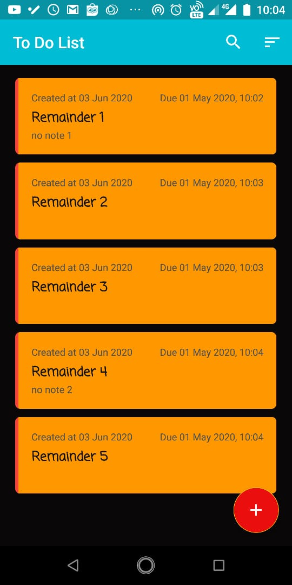
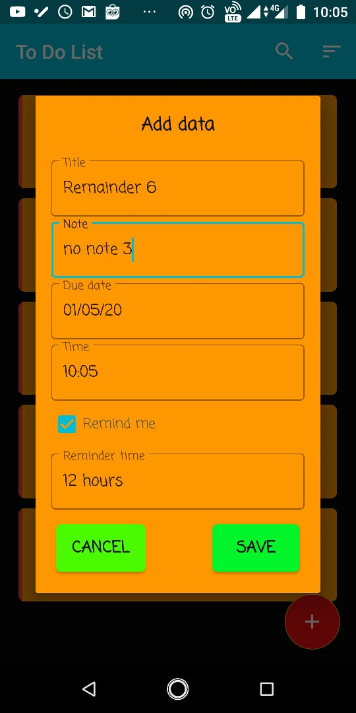
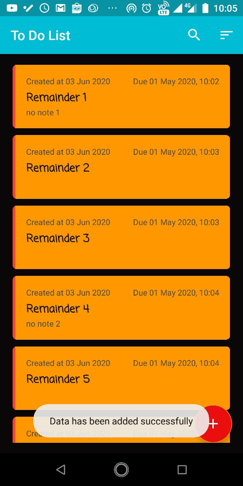
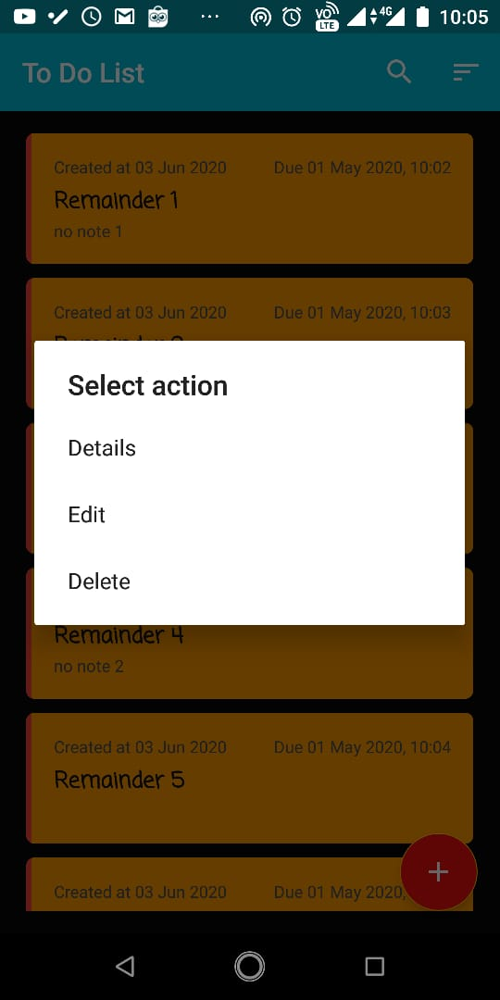
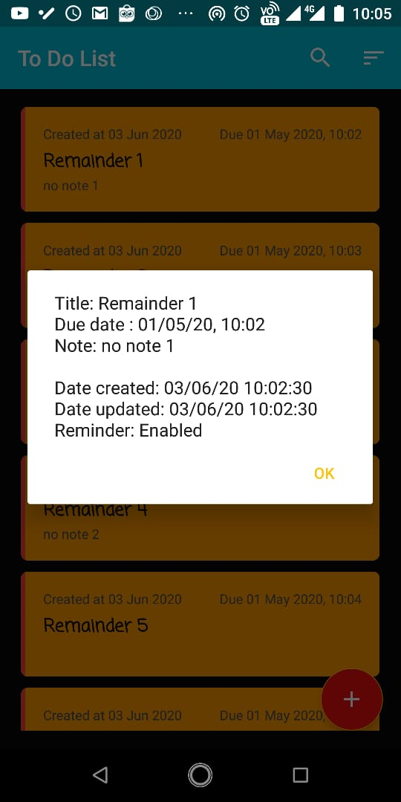
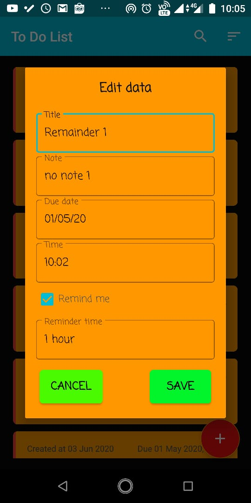

## To Do List

Simple task management and reminder app using
- ROOM Database
- MVVM Architecture
- RecyclerView
- Material UI

### Features:
- Side indicator for task status
  - Red -> Passed tasks
  - Yellow -> Today's tasks
  - Blue -> Later's tasks
- Searching
- Sorting
- Reminder

## Screenshots

